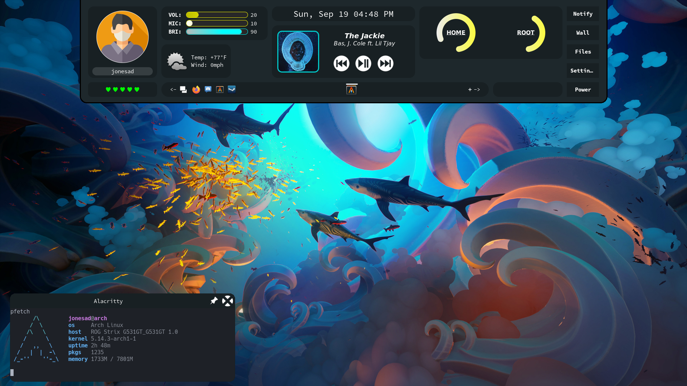
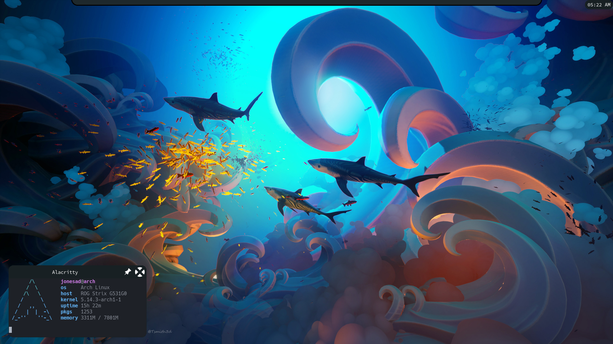
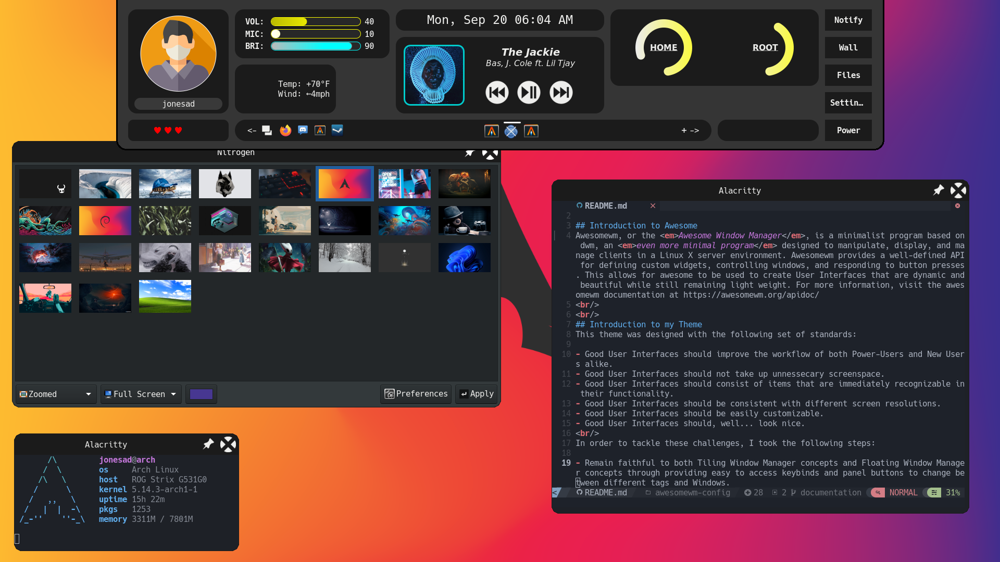
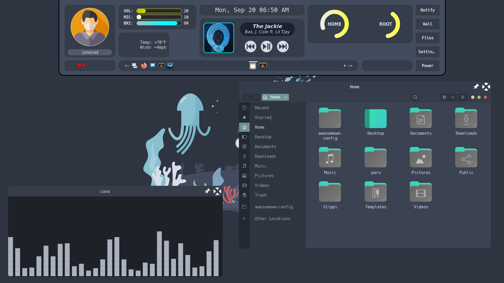
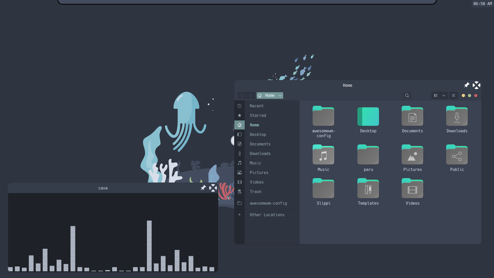

# Welcome to my Awesomewm dotfiles

## Introduction to Awesome
Awesomewm, or the <em>Awesome Window Manager</em>, is a minimalist program based on dwm, an <em>even more minimal program</em> designed to manipulate, display, and manage clients in a Linux X server environment. Awesomewm provides a well-defined API for defining custom widgets, controlling windows, and responding to button presses. This allows for awesome to be used to create User Interfaces that are dynamic and beautiful while still remaining light weight. For more information, visit the awesomewm documentation at https://awesomewm.org/apidoc/
<br/>
<br/>
## Introduction to my Theme
This theme was designed with the following set of standards:

- Good User Interfaces should improve the workflow of both Power-Users and New Users alike. 
- Good User Interfaces should not take up unnessecary screenspace.
- Good User Interfaces should consist of items that are immediately recognizable in their functionality.
- Good User Interfaces should be consistent with different screen resolutions.
- Good User Interfaces should be easily customizable.
- Good User Interfaces should, well... look nice.
<br/>
In order to tackle these challenges, I took the following steps:

- Remain faithful to both Tiling Window Manager concepts and Floating Window Manager concepts through providing easy to access keybinds and panel buttons to change between different tags and Windows.
- The panel hides itself when the Super Key (Windows button on most keyboards) is not held down and the mouse is not hovering over the panel. It hides itself down to 1/40th of its regular size. 
- Contains easily recognizable symbols and buttons, such as the volume, microphone, and brightness bars, the weather widget with its weather icons, and the music player with its control icons.
- This configuration uses Awesome's beautiful.xresources library to account for the dpi, or dots-per-inch, of the current display, as recognized by xrdb, to determine sizes independent of the actual screen resolution. 
<br/>

## Gallery
**Note: The following images are subject to, and <em>will</em>, change as the project develops. As a primary example, several colors in the panel are not currently defined by gtk and <em>will</em> be in the future.**
<br/>
<p align='center'>The following images uses the <strong><a href='https://github.com/EliverLara/Juno')>Juno</a></strong> GTK3+ theme:</p>


<br/>
<p align='center'>The following uses the <strong>Adwaita-Dark</strong> GTK3+ theme:</p>

<p align='center'>The following images use the <strong><a href='https://github.com/EliverLara/Nordic'>Nordic</a></strong> GTK3+ theme:</p>




## Functionality
By default, Awesomewm comes with a set of fairly sane defaults. However, many aspects of modern desktop environments are left to the user to work around or designate to external programs. As an example, the default Awesomewm config does not have any way to modify the volume of the system or display the battery life. To do so, you would need to install a third-party systray application or make a custom configuration. Another example comes in the form of the panel not hiding for fullscreen applications by default. My configuration offers the following features over the basic awesomewm config:

* On Screen Volume, Microphone Volume, and Brightness Controls 
* On Screen Battery Display
* On Screen Weather provided by wttr.in
* Clickable shortcuts for common applcations (WIP)
* Buttons to swap between Virtual Desktops, or more precisely, tags.
* Built in MPD, or Music Player Daemon, Controls.
* Easily Configure Panel Settings, such as changing profile image (WIP)
* View disk usage for both home and root partitions.

## TODO
- [ ] Make it possible to change taskbar shortcuts through GUI
- [ ] Pull Album Art using metadata from some database for MPD display
- [x] Get more colors from the GTK theming<sup>WIP</sup>
- [ ] Add Missing Weather States from wttr.in to icon set.
- [ ] Finalize Icon Set
- [ ] Make Settings panel
- [ ] Make notifications window
- [x] Make Poweroff Prompt <sup>WIP</sup>
- [ ] Display current tag name in front of Tasklist.
- [x] Correct Rofi themeing <sup>WIP</sup>
- [ ] Make Bars respond to click events rather than poll.
- [x] Make MPD respond to click events rather than poll.
- [x] Simplify & Clean Design
- [ ] Installation Playbook


### Required Dependencies
| Name | Comment | Reason |
| --- | --- | --- |
| [`awesome-git`](https://github.com/awesomeWM/awesome) | Core Window Management | Core of UI. awesome-<em>git</em> needed for certain features.
| [`rofi`](https://github.com/davatorium/rofi) | Dmenu Replacement with CSS styling | Application Launcher/Fallback Alt-Tab |
| [`mpc`](https://github.com/MusicPlayerDaemon/mpc)| MPD Control Program | Music Widget Controls uses this |
| [`pamixer`](https://github.com/cdemoulins/pamixer)| PulseAudio/PipeWire Volume Controller | Volume and Microphone Volume Controls use this |
| [`brightnessctl`](https://github.com/Hummer12007/brightnessctl)| Screen Brightness Controller | Brightness Control uses this |
| [`upower`](https://github.com/freedesktop/upower)| Power Daemon | Configures Power for System & Battery widget uses this|
<br/>
***NOTE: PLEASE INSTALL WHAT YOU CAN FROM YOUR PACKAGE MANAGER FIRST***

## Installation
One of my tenants for good UI is that it <em>cannot</em> be over overly-specialized. Overly-specialized UI's are generally amazing for what they are designed for and <em>useless</em> for everything else. Being useable for everyone is a core goal of the project. As such, the installation is designed to be simple with minimal dependencies. 
<br/>
1. Install the [Dependencies](#required_dependencies)
2. Clone the repository into the $HOME/.config/awesome directory. To do so, please copy the following command:
```git clone https://github.com/jonesad-etsu/awesomewm-config.git $HOME/.config/awesome```
<br/>
OR
<br/>
- Use the provided [Ansible Playbook](#todo)

## How to Contribute

## Credits
